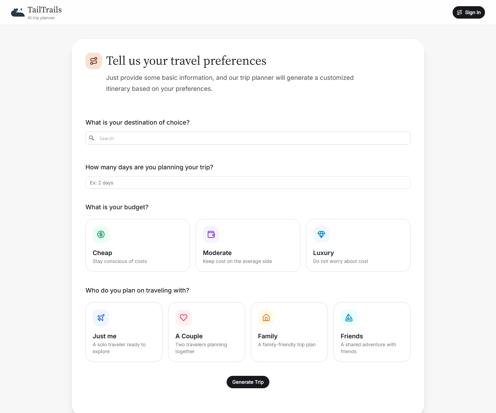

# TailTrails

TailTrails is an AI trip planner that generates personalized itineraries from a destination, trip length, budget, and traveler group. It uses a small serverless AI proxy for itinerary generation, Mapbox Search for destination lookup, Firebase for saved trips, and a polished React/Vite interface.

## Screenshots

### Home


### Trip Preferences



## Features

- AI-generated hotel recommendations and day-by-day places to visit
- Destination search with a browser-safe Mapbox public token
- Google sign-in and saved trips with Firebase
- Serverless AI proxy for itinerary generation
- Graceful visual fallbacks when AI-provided image URLs are missing or broken
- Responsive, editorial-style UI with lucide-react icons

## Tech Stack

- React 19
- Vite 7
- Tailwind CSS 4
- Firebase / Firestore
- Mapbox Search
- Vercel serverless functions
- lucide-react

## Environment Variables

Create a `.env.local` file using `.env.example` as a starting point:

```env
VITE_AI_PROXY_URL=
VITE_MAPBOX_PUBLIC_TOKEN=
```

`VITE_AI_PROXY_URL` should point at the deployed AI proxy endpoint, for example:

```env
VITE_AI_PROXY_URL=https://your-vercel-app.vercel.app/api/generate-trip
```

For local Vercel development, it can be:

```env
VITE_AI_PROXY_URL=http://localhost:3000/api/generate-trip
```

Do not put OpenRouter keys in frontend `VITE_*` variables. The proxy reads `OPENROUTER_API_KEY` from the server environment only.

## Getting Started

Install dependencies:

```bash
npm install
```

Run the development server:

```bash
npm run dev
```

Build for production:

```bash
npm run build
```

Run lint checks:

```bash
npm run lint
```

## Production Deployment

### Frontend on GitHub Pages

GitHub Pages serves the static Vite build. Only browser-safe variables should be present in the frontend build:

- `VITE_AI_PROXY_URL`
- `VITE_MAPBOX_PUBLIC_TOKEN`

Never deploy `sk.*` Mapbox secret tokens or OpenRouter API keys in a Vite frontend bundle.

### AI Proxy on Vercel

The serverless function lives at `api/generate-trip.js` and is compatible with Vercel.

Set these Vercel environment variables:

```env
OPENROUTER_API_KEY=your_server_only_openrouter_key
ALLOWED_ORIGIN=https://amazingdude.github.io
```

`OPENROUTER_API_KEY` is server-only and should never be prefixed with `VITE_`.

After deploying the Vercel project, copy its function URL into the GitHub Pages frontend build as `VITE_AI_PROXY_URL`.

### Mapbox Token

Use a browser-safe Mapbox public token for `VITE_MAPBOX_PUBLIC_TOKEN`. Do not use a secret access token in the frontend.
